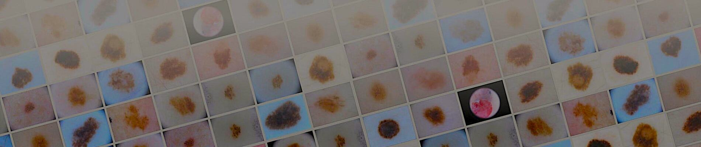
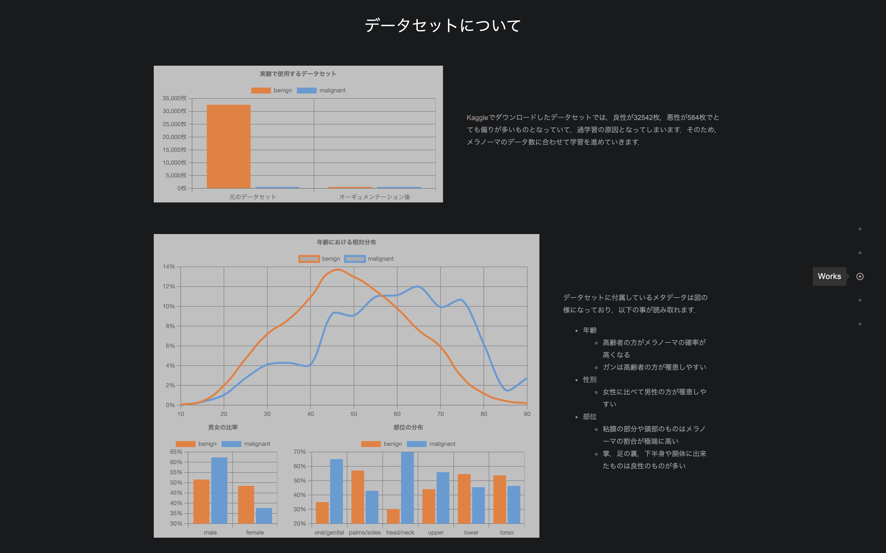

# Melanoma Classification
## Dataset
### SIIM-ISIC Melanoma Classification

Download [here](https://www.kaggle.com/c/siim-isic-melanoma-classification/data)
## Quick Start
```python
# default.py
from yacs.config import CfgNode as CN
from pathlib import Path

_C = CN()

_C.DATASET = CN()
_C.DATASET.NAME = 'SIIM-ISIC Melanoma'
_C.DATASET.ROOT = 'path to root'  # Change the path
...
```
```bash
# install requirements
pip install -r requirements.txt
# run code
python3 main.py
```
## Train Model
```python
# main.py
from tools import Trainer

trainer = Trainer(cfg=cfg)
trainer.train()
```
# Evaluate Model
```python
# main.py
from tools import Trainer

trainer = Trainer(cfg=cfg)
trainer.evaluate('saved model path')
```
## For More Information

Visit [here](https://a5chin.github.io/portfolio/works/melanoma.html)
